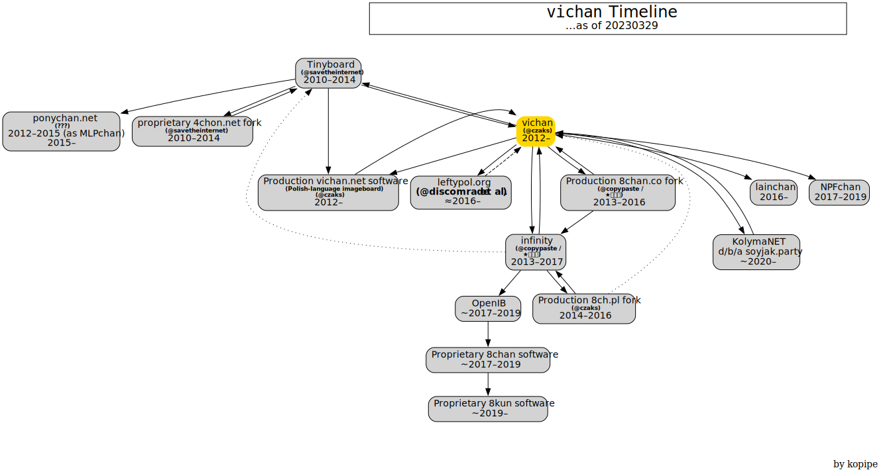

vichan - A lightweight and full featured PHP imageboard.
========================================================

**Please do not contact Fredrick Brennan in regards to vichan issues.**

As of 29 August 2022 it supports PHP8.1.

About
------------
vichan is a free light-weight, fast, highly configurable and user-friendly
imageboard software package. It is written in PHP and has few dependencies.

Some documentation may be found on our [wiki](https://github.com/vichan-devel/vichan/wiki). (feel free to contribute)

History
------------
vichan is a fork of (now defunc'd) [Tinyboard](http://github.com/savetheinternet/Tinyboard),
a great imageboard package, actively building on it and adding a lot of features and other
improvements.



### Maintainer timeline
1. [@perdedora](https://github.com/perdedora) and [@RealAngeleno](https://github.com/RealAngeleno) - 2023-Present.
2. Development Commission lead by [@basedgentoo](https://github.com/basedgentoo), [@kuz-sysadmin](https://github.com/kuz-sysadmin), and [@RealAngeleno](https://github.com/RealAngeleno). (2023 - 2023)
3. [@h00j](https://github.com/h00j) (2021 - ???)
4. [@ctrlcctrlv](https://github.com/ctrlcctrlv) (2017 - 2021)
5. [@czaks](https://github.com/czaks) (2014 - 2017) (The author of vichan fork)
6. [@savetheinternet](https://github.com/savetheinternet) (2010 - 2014) (The creator of Tinyboard)

Requirements
------------
1.	PHP >= 7.4
2.	MySQL/MariaDB server
3.	[mbstring](http://www.php.net/manual/en/mbstring.installation.php)
4.	[PHP GD](http://www.php.net/manual/en/intro.image.php)
5.	[PHP PDO](http://www.php.net/manual/en/intro.pdo.php)
6.	A Unix-like OS, preferrably FreeBSD or GNU/Linux

We try to make sure vichan is compatible with all major web servers. vichan does not include an Apache `.htaccess` file nor does it need one.

### Recommended
1.	MySQL/MariaDB server >= 5.5.3
2.	ImageMagick (command-line ImageMagick or GraphicsMagick preferred).
3.	[APCu (Alternative PHP Cache)](http://php.net/manual/en/book.apcu.php),
	[Memcached](http://www.php.net/manual/en/intro.memcached.php) or
	[Redis](https://redis.io/docs/about/)

Contributing
------------
You can contribute to vichan by:
*	Developing patches/improvements/translations and using GitHub to submit pull requests
*	Providing feedback and suggestions
*	Writing/editing documentation

Installation
-------------
1.	Get the latest development version with:

        git clone git://github.com/vichan-devel/vichan.git

2.	run ```composer install``` inside the directory
3.	Navigate to ```install.php``` in your web browser and follow the
	prompts.
4.	vichan should now be installed. Log in to ```mod.php``` with the
	default username and password combination: **admin / password**.

Please remember to change the administrator account password.

See also: [Configuration Basics](https://github.com/vichan-devel/vichan/wiki/config).

Upgrade
-------
To upgrade from any version of Tinyboard or vichan:

Either run ```git pull``` to update your files, if you used git, or
backup your ```inc/instance-config.php```, replace all your files in place
(don't remove boards etc.), then put ```inc/instance-config.php``` back and
finally run ```install.php```.

To migrate from a Kusaba X board, use http://github.com/vichan-devel/Tinyboard-Migration

Demo
--------
Demo with the most updated version of [Vichan](https://vichan.27chan.org).

1. PHP 8.1
2. MySQL 5.7
3. KeyDB 6.2.1 (Redis)
4. NGINX 1.14.0

Support
--------
vichan is still beta software -- there are bound to be bugs. If you find a
bug, please report it.

CLI tools
-----------------
There are a few command line interface tools, based on Tinyboard-Tools. These need
to be launched from a Unix shell account (SSH, or something). They are located in a ```tools/```
directory.

You actually don't need these tools for your imageboard functioning, they are aimed
at the power users. You won't be able to run these from shared hosting accounts
(i.e. all free web servers).

Oekaki
------
vichan makes use of [wPaint](https://github.com/websanova/wPaint) for oekaki. After you pull the repository, however, you will need to download wPaint separately using git's `submodule` feature. Use the following commands:

```
git submodule init
git submodule update
```

To enable oekaki, add all the scripts listed in `js/wpaint.js` to your `instance-config.php`.

WebM support
------------
Read `inc/lib/webm/README.md` for information about enabling webm.

vichan API
----------
vichan provides by default a 4chan-compatible JSON API. For documentation on this, see:
https://github.com/vichan-devel/vichan-API/ .

License
--------
See [LICENSE.md](http://github.com/vichan-devel/vichan/blob/master/LICENSE.md).
